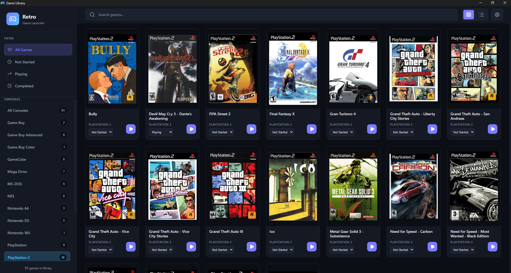
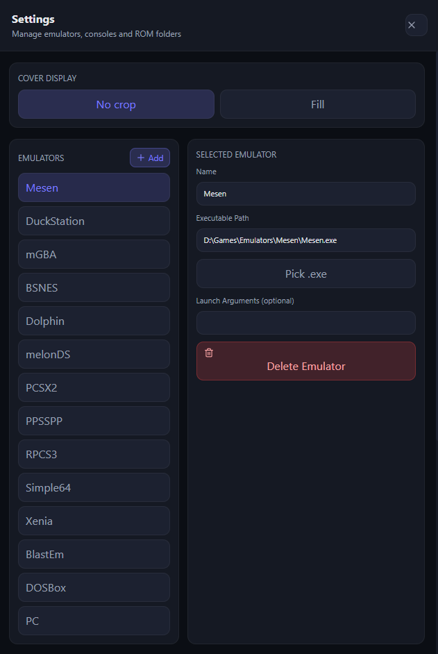
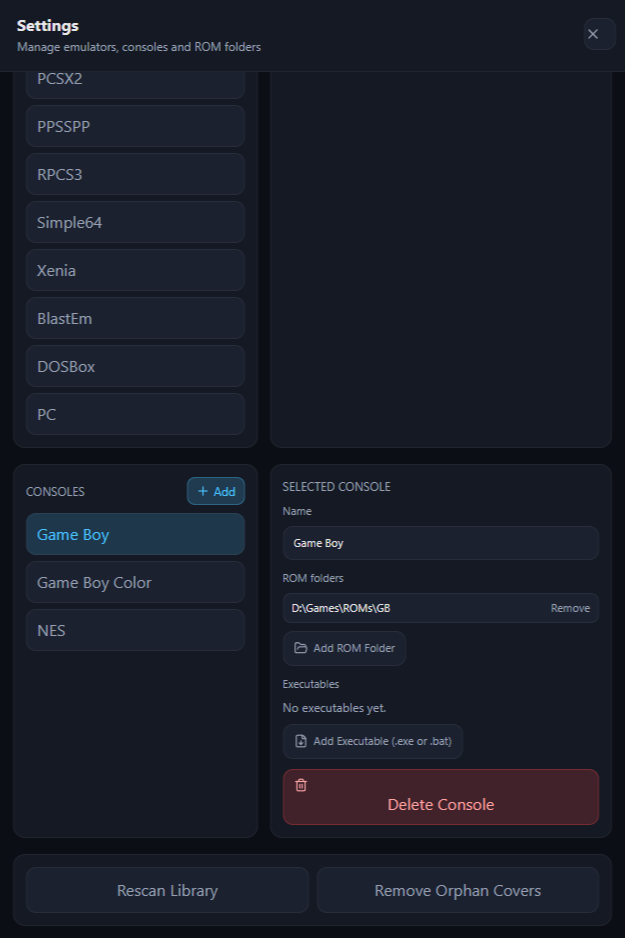

# 🎮 Desktop Game Launcher (Electron)

A desktop application for organizing and launching local games across multiple emulators, with automatic ROM detection and library management.

The project was built with a focus on data structure, process automation, and user experience, making it easier to centralize different platforms and efficiently manage game libraries.

---

## 🚀 Features

- Automatic game detection from configured directories  
- Support for multiple emulators  
- Game launching with custom arguments  
- Organization by console/platform  
- Name normalization to maintain a consistent library  
- Automatic cover art association  
- Status tracking (not started, playing, completed)  
- Orphan cover cleanup  

---

## 🧠 Architecture

The project follows a layered architecture with clear separation of responsibilities:

- Main (Node.js / Electron)  
  - File reading services  
  - Process execution for emulators  
  - Data persistence  

- Renderer (React)  
  - User interface  
  - Reusable components  
  - UI state management  

This structure improves scalability, maintainability, and code organization.

---

## 🛠️ Stack

- Electron  
- Node.js  
- React  
- TailwindCSS  
- JavaScript  

---

## 🖼️ Preview

Below are some screenshots of the application:

### Game Library

### Emulator Settings

### Console Settings

---

## ⚙️ How to Run

npm install  
npm run dev  

---

## 📁 Project Structure

src/  
  main/        # main process logic (Electron / Node)  
  renderer/    # interface (React)  

---

## 🎯 Project Goal

This project was designed to:

- Centralize games from multiple platforms  
- Automate manual processes such as ROM scanning and organization  
- Apply solid architectural practices in desktop applications  

---

## 📄 Notes

This project does not include ROMs or copyrighted files.  
All paths and data are configured locally.

---

## 👨‍💻 Author

Developed by [@afpederiva](https://github.com/afpederiva)